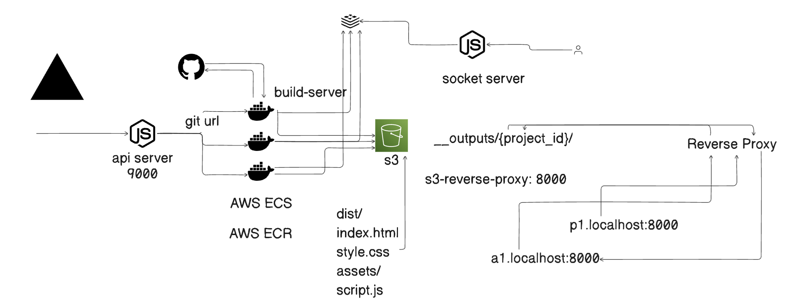

# DeployHub

DeployHub is a full-stack deployment platform inspired by Vercel. It lets users connect repositories, trigger deployments, stream build logs in real time, and serve production-ready static builds through subdomain-based routing.

## Workflow Overview



## How DeployHub Works

1. **User Authentication & Project Setup**
   - Users authenticate via GitHub OAuth.
   - A project is created with repository URL, framework, and generated subdomain metadata.

2. **Deployment Trigger**
   - A deployment request is created through the API server.
   - The API server stores deployment state and starts a build task on AWS ECS Fargate.

3. **Build & Artifact Upload**
   - The build server clones the repository, installs dependencies, and runs the project build.
   - Generated artifacts are uploaded to S3 under a project-scoped output path.

4. **Logs & Status Tracking**
   - Build logs are published to Kafka.
   - The API server consumes logs, stores them in ClickHouse, and updates deployment status in PostgreSQL via Prisma.

5. **Serving Deployed Output**
   - The reverse proxy resolves incoming subdomains to project IDs.
   - Static assets are served from S3 paths, including framework-specific routing behavior.

## Repository Structure

- `/vercel` (frontend dashboard) — React + Vite UI application
- `/api-server` — Express API for auth, projects, deployments, logs, and ECS task orchestration
- `/build-server` — Builder runtime (clone, build, upload, log publishing)
- `/s3-reverse-proxy` — Reverse proxy that maps subdomains to deployed S3 outputs

## Core Tech Stack

- **Frontend:** React, Vite, Tailwind CSS
- **Backend:** Node.js, Express, Prisma
- **Infrastructure:** AWS ECS Fargate, Amazon S3
- **Messaging & Logs:** Kafka, ClickHouse
- **Database:** PostgreSQL

## Local Development

### Prerequisites

- Node.js 20+
- npm
- PostgreSQL
- Kafka broker
- AWS credentials and ECS/S3 setup

### Install Dependencies

```bash
cd api-server
npm install
cd ../build-server
npm install
cd ../s3-reverse-proxy
npm install
cd ../vercel
npm install
```

### Run Services

```bash
# API server
cd api-server
node index.js

# Build server (usually ECS task runtime)
cd ../build-server
node script.js

# Reverse proxy
cd ../s3-reverse-proxy
node index.js

# Frontend
cd ../vercel
npm run dev
```

## Notes

- Set all required environment variables before starting services.
- Update endpoint URLs and domain settings for non-local deployments.
- The frontend currently contains legacy scaffold/demo sections in addition to DeployHub logic.
